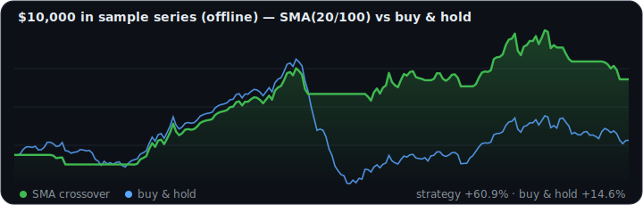

 

  

**I build the full quantitative-finance stack — a matching engine, the pricing math, a backtester, and a language to write strategies in — then use it to test trading ideas *honestly* in a monthly research lab, publishing what the data really says (null results included).**

 

## 📊 By the numbers

| 🧪 Tests passing | 🔬 Research papers | 🏦 Quant repos | 🧮 Pricing engines | ⚡ Order book |
|:--:|:--:|:--:|:--:|:--:|
| **140+** | **3** · reproducible | **6** | **3** cross-validating | **165k** orders/sec |

## 🔬 Neil Quant Labs — I run a monthly research lab

> **A question, an experiment, an honest answer — including the null ones.** Most projects claim to *find* edges; this lab rigorously tests whether claimed edges are *real*, and reports what the data actually says. Every note is a hypothesis fixed in advance, a reproducible experiment with no lookahead, and a written paper — findings that stand on their own, especially when the answer is "it doesn't work."

| # | Question | Honest finding |
|:--:|---|---|
| **001** | Do backtests overstate performance? | A 1-line lookahead bug inflates a strategy's Sharpe by **+1.12**; cherry-picking 337 strategies on random data fakes a **0.77** Sharpe that flips to **−0.54** out-of-sample |
| **002** | Does volatility predict next-day *direction*? | Across 2,881 days of SPY, today's volatility → tomorrow's return correlation is **+0.035** — no meaningful directional edge (R² ≈ 0.1%) |
| **003** | Momentum vs. mean reversion, after costs? | Over 4,916 days, **neither beats buy-and-hold** — but each is a regime bet: mean reversion earns a **1.07** Sharpe in bear markets, then its ~6× turnover lets 5bp costs turn it **negative** |

**[📄 Read the papers](https://github.com/hilothefunnydog123-coder/quant-research)** · **[🔁 Reproduce any note](https://github.com/hilothefunnydog123-coder/quant-research#reproduce-any-note)** · **[📌 Cite this work](https://github.com/hilothefunnydog123-coder/quant-research#license--citation)** · *open to contributors*

## 📈 Live strategy tracker

<!--TRACKER:START-->
> 🤖 **Auto-updated daily by a GitHub Action** — a backtest of my own [quantsim](https://github.com/hilothefunnydog123-coder/quantsim) engine, refreshed every morning. *(paper research, not investment advice)*

| as of | strategy | buy & hold | verdict |
|:--|:--|:--|:--|
| `2026-07-20` on sample series (offline) | **+60.9%** · Sharpe 0.72 · maxDD -21.3% | +14.6% · Sharpe 0.22 | ✅ beating buy & hold |
<!--TRACKER:END-->

## 🚀 About me

I got curious about how markets *actually* work — so I built the whole stack to find out: a matching engine, the pricing math, a backtester, a live trading bot, and finally a language to write strategies in. Then I started a research lab to point that stack at real data and test popular trading ideas the honest way — hypothesis first, no lookahead, realistic costs, and the null results published alongside the wins. I like zero-dependency code, tests that assert real properties (not just "it runs"), and work you can reproduce in under a minute.

- 💸 **Quantitative finance** — backtesting, options pricing, market microstructure, honest strategy evaluation
- 🔬 **Research** — reproducible experiments, dual-licensed papers, methodology over hype
- 🤖 **AI developer tooling** — MCP servers and infrastructure for LLMs

## 📌 Featured projects

| Project | What it does | Built with |
|---|---|---|
| 🔬 [**quant-research**](https://github.com/hilothefunnydog123-coder/quant-research) | **Neil Quant Labs** — monthly, peer-reviewable quant research. Reproducible experiments + written papers that report the honest answer, null results included. Open to contributors | Python |
| 📈 [**quantsim**](https://github.com/hilothefunnydog123-coder/quantsim) | Full quant stack — backtesting engine, price-time-priority order book with market-impact execution, Monte Carlo risk analytics, and a live paper-trading bot that commits its P&L to git | Python · NumPy |
| 🏛️ [**exchange-simulator**](https://github.com/hilothefunnydog123-coder/exchange-simulator) | Agent-based market where fat tails, volatility clustering & flash crashes *emerge* from autonomous traders — statistically verified | Python |
| 📜 [**quantlang**](https://github.com/hilothefunnydog123-coder/quantlang) | A programming language for trading strategies — hand-written lexer, parser & interpreter; compiled output proven bitwise-identical to hand-written Python | Python |
| 🧮 [**optionslab**](https://github.com/hilothefunnydog123-coder/optionslab) | Options pricing with three independent engines that cross-validate to 4 decimals — Black–Scholes, binomial trees, Monte Carlo — plus Greeks & implied vol | Python |
| 🧭 [**pathfinding-visualizer**](https://github.com/hilothefunnydog123-coder/pathfinding-visualizer) | Watch A*, Dijkstra, BFS & Greedy race across a grid you draw — 60fps canvas, zero deps | JavaScript |

## 🛠️ Tech stack

## 🐍 My contribution graph

<picture>
  <source media="(prefers-color-scheme: dark)" srcset="https://raw.githubusercontent.com/hilothefunnydog123-coder/hilothefunnydog123-coder/output/snake-dark.svg"/>
  <source media="(prefers-color-scheme: light)" srcset="https://raw.githubusercontent.com/hilothefunnydog123-coder/hilothefunnydog123-coder/output/snake.svg"/>
  
</picture>

## 📊 GitHub stats

The banner and strategy tracker above regenerate themselves daily via GitHub Actions — the code is in <a href="assets/">/assets</a>.

